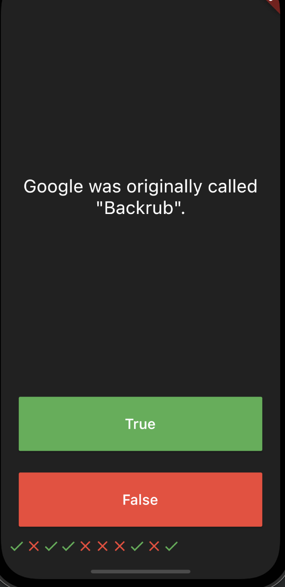
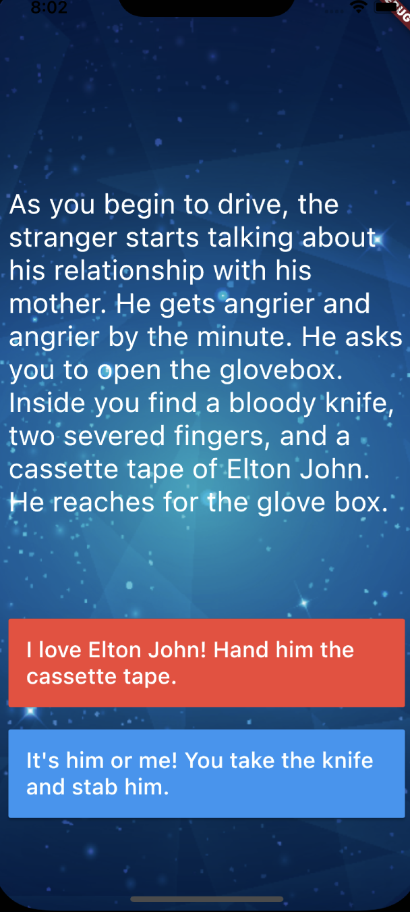
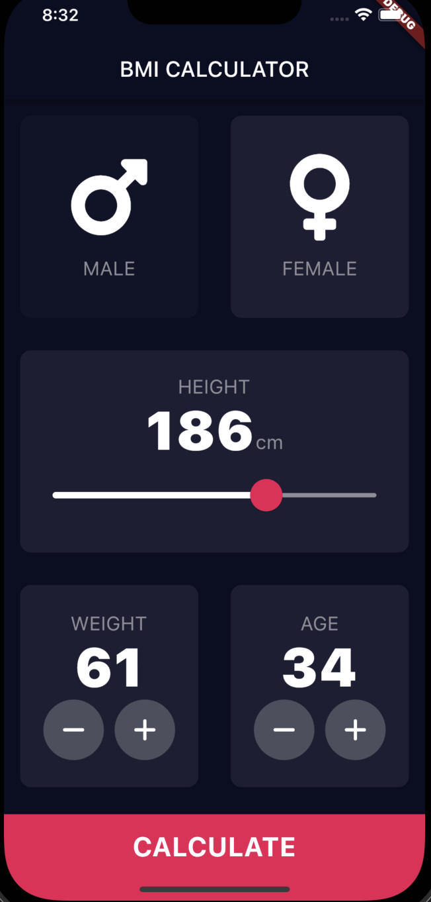
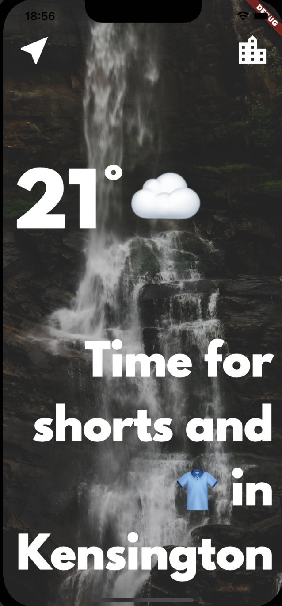

## The App Brewery - Flutter Bootcamp
The Complete Flutter Development Bootcamp Using Dart

In order to run any of these apps you can clone the repo and run the app on your local machine, but please make sure that you have [Flutter-SDK](https://flutter.dev/docs/get-started/install) installed:

# Instruction: 
```
git clone https://github.com/CezaryZywicki/Flutter-Development-Bootcamp.git
cd Flutter-Development-Bootcamp
# choose your app (f.e destini-game)
cd destini-game
fluttter run
```

## Quizzler




## Destini Game



## BMI-Calculator



## Clima App


